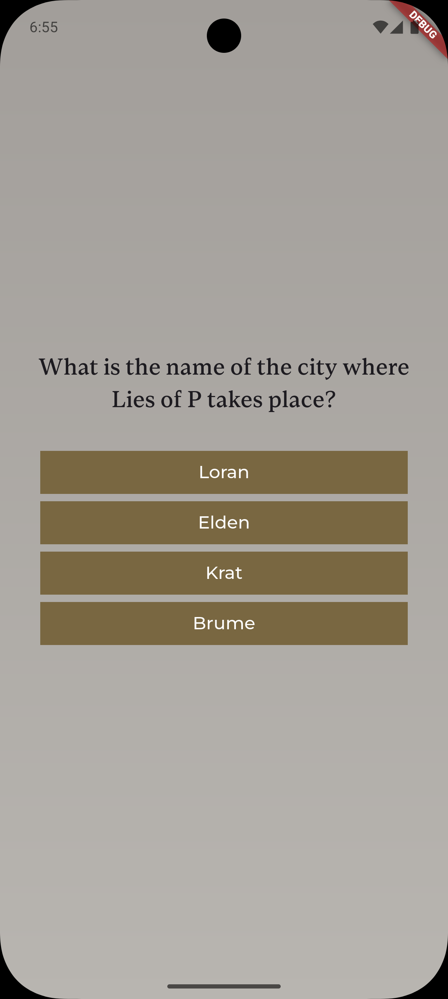
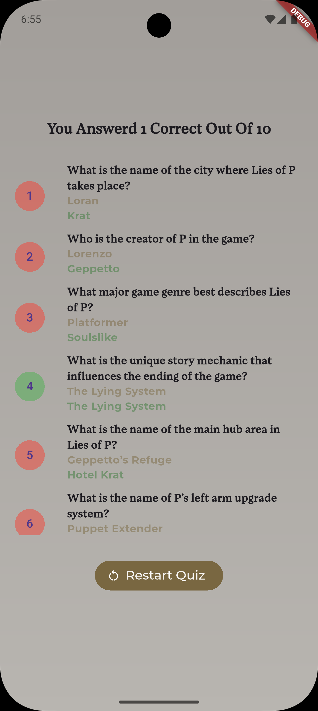

# Lies of P Quiz App 🎭⚙️

[](https://flutter.dev/)
[](https://dart.dev/)

A simple and interactive quiz application built with Flutter, designed to test your knowledge of the captivating world of Lies of P game.

## ✨ Features

- **Interactive Quiz Experience**: Engaging multiple-choice questions with immediate feedback
- **Score Tracking**: Keep track of your performance and see how well you know the game
- **Clean UI**: Modern, intuitive interface designed for seamless navigation
- **Cross-Platform**: Runs on both Android and iOS devices

## 📱 Screenshots

| Main Screen                                   | Questions Screen                                     | Result Screen                                    |
| --------------------------------------------- | ---------------------------------------------------- | ------------------------------------------------ |
|  |  |  |

## 🚀 Getting Started

### Prerequisites

- Flutter SDK (version 3.0.0 or higher)
- Dart SDK
- Android Studio / VS Code with Flutter extensions
- Android device/emulator or iOS simulator

### Installation

1. **Clone the repository**

   ```bash
   git clone https://github.com/BlueEye2077/liesOfP-Quiz-App.git
   cd liesOfP-Quiz-App
   ```

2. **Install dependencies**

   ```bash
   flutter pub get
   ```

3. **Run the app**

   ```bash
   flutter run
   ```

## 📂 Project Structure

```
lib/
├── main.dart                 # App entry point
├── models/                   # Data models for questions and quiz logic
├── screens/                  # UI screens (quiz, results, home)
├── widgets/                  # Reusable UI components
├── utils/                    # Helper functions and constants
└── data/                     # Quiz questions and game data
```

## 🎯 How to Play

1. **Start the Quiz**: Launch the app and tap "Start Quiz"
2. **Answer Questions**: Select your answer from the multiple-choice options
3. **Track Progress**: Watch your score update in real-time
4. **View Results**: See your final score and review correct answers
5. **Retry**: Challenge yourself again to improve your score!

## 🛠️ Built With

- **Flutter** - UI framework for cross-platform development
- **Dart** - Programming language

## 👨‍💻 Author

**BlueEye2077**

- GitHub: [@BlueEye2077](https://github.com/BlueEye2077)

**Enjoy testing your Lies of P knowledge! 🎭**